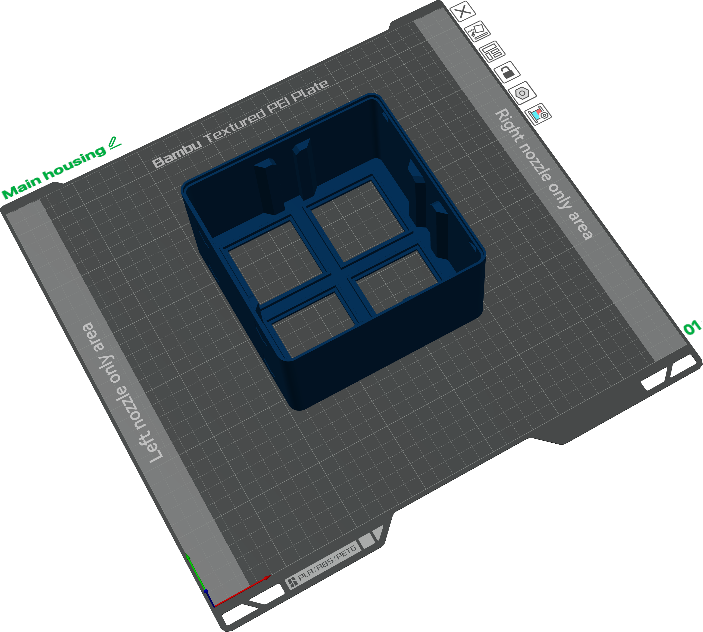
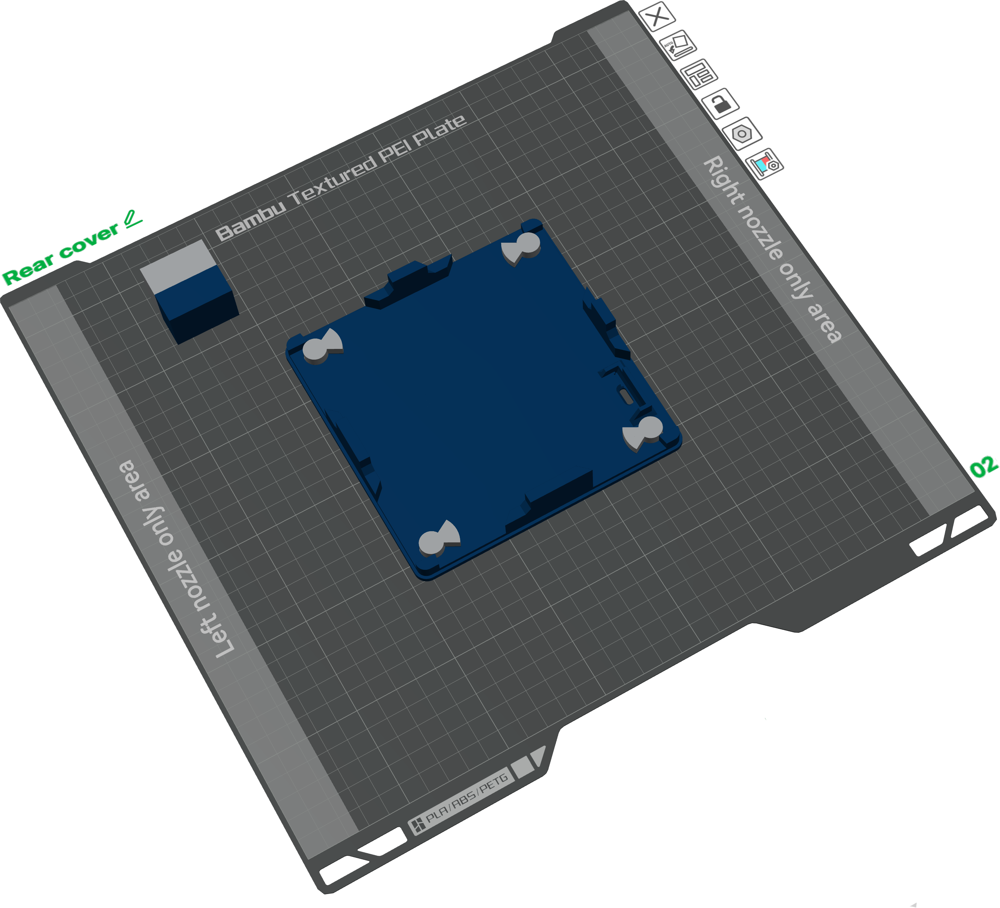
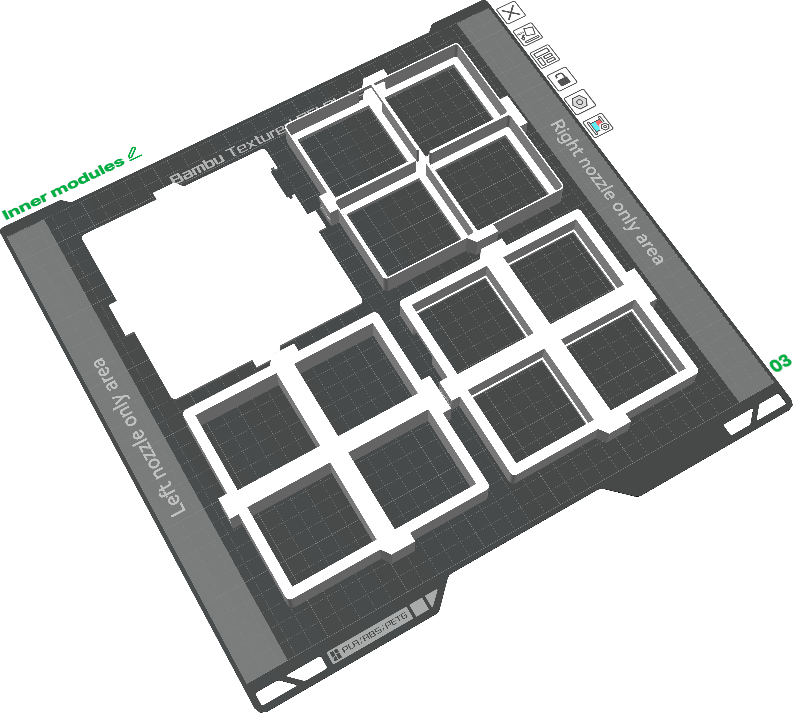
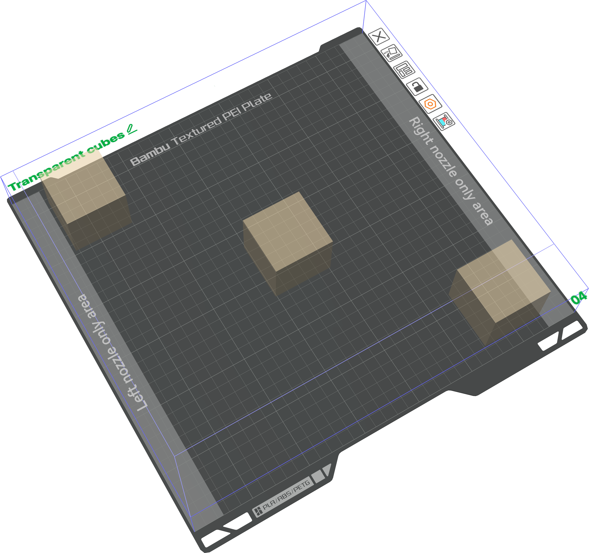

# Model Files — High Five Hive

This folder contains all printable files for the ***"High Five Hive"*** speaker lamp, including the master Bambu Studio project file and the individual STL components.

---

## Project file

**`experts-live-high-five-hive.3mf`** — the Bambu Studio project file containing all four build plates, pre-arranged with their settings, filament assignments, and plate configurations. Open this file in Bambu Studio to print directly without any manual setup.

All plate settings (layer height, supports, print sequence) are embedded in the `.3mf`. A **textured PEI plate** is strongly recommended for both the housing and the rear cover to get a nice surface finish on the visible exterior faces.

---

## Build plates

| # | Plate | Contents | Material | Notes |
| --- | --- | --- | --- | --- |
| 1 | [Main housing](#plate-1--main-housing) | Outer shell | Dark Blue Matte PLA | Fuzzy skin on all exterior surfaces |
| 2 | [Rear cover](#plate-2--rear-cover) | Cover body, logo letters, mascot, screws, supports | Dark Blue + Ash Grey Matte PLA | Multi-material; many small objects |
| 3 | [Inner modules](#plate-3--inner-modules) | Cube holders, LED frame, holder plate | Ivory White Matte PLA | Single material |
| 4 | [Transparent cubes](#plate-4--transparent-cubes) | Light diffusion cubes (3 of 4) | Translucent PLA — Mellow Yellow | Vase mode; 0.8 mm nozzle; print 4th cube separately |

---

### Plate 1 — Main housing

The outer dark navy blue shell of the lamp. Printed as a single object.

**Fuzzy skin** is applied to all exterior surfaces to give the housing a soft matte texture that hides layer lines and matches the look of the crystal speaker cubes.

| File | Description |
| --- | --- |
| `experts-live-high-five-hive-housing-main.stl` | Outer housing shell |

- **Material:** Bambu Labs Matte PLA — Dark Blue
- **Plate:** Textured PEI plate strongly recommended

---

### Plate 2 — Rear cover

The back panel with the *Experts Live / 5 Years* branding and the four quarter-turn twist-lock screws. This is a multi-material plate combining Dark Blue for the cover body and Ash Grey for the raised logo, lettering, and screw hardware.

The cover is intentionally built from many small individual objects rather than one solid model:

- **Individual letters** for "EXPERTS LIVE" and "5 YEARS" are separate STLs, allowing precise colour assignment to each character without painting.
- **Mascot logo** is split into multiple parts for the same reason.
- **Key supports** are custom-designed objects placed around each screw to prevent the screw from fusing with the cover during printing. They are printed in Ash Grey and can be broken free cleanly after the print.

| File | Description |
| --- | --- |
| `experts-live-high-five-hive-housing-cover.stl` | Main cover body |
| `experts-live-high-five-hive-housing-cover-01-ex.stl` … `09-e.stl` | Individual letters — *Experts Live* |
| `experts-live-high-five-hive-housing-cover-10-mascotte-*.stl` | Experts Live mascot logo (multiple parts) |
| `experts-live-high-five-hive-housing-cover-11-5.stl` … `16-S.stl` | Individual letters — *5 Years* |
| `experts-live-high-five-hive-screw-1.stl` … `screw-4.stl` | Quarter-turn twist-lock screws |
| `experts-live-high-five-hive-screw-1-key-support.stl` … `screw-4-key-support.stl` | Screw key supports (prevent fusing) |

- **Materials:** Bambu Labs Matte PLA — Dark Blue (cover body) + Ash Grey (logo, letters, screws, key supports)
- **Plate:** Textured PEI plate strongly recommended

---

### Plate 3 — Inner modules

The internal structural parts that hold the LED strip and crystal cubes in position inside the housing. All parts are printed in Ivory White.

| File | Description |
| --- | --- |
| `experts-live-high-five-hive-1-cube-holder.stl` | Cube holder frame — type 1 |
| `experts-live-high-five-hive-2-led-frame.stl` | LED strip frame |
| `experts-live-high-five-hive-3-cube-holder.stl` | Cube holder frame — type 3 |
| `experts-live-high-five-hive-3-cube-holder-plate.stl` | Cube holder backing plate |

- **Material:** Bambu Labs Matte PLA — Ivory White

---

### Plate 4 — Transparent cubes

The four small light-diffusion cubes that sit inside each compartment and scatter the LED light through the crystal speaker cubes above them. Three cubes are printed on this plate; **the fourth must be sent as a separate print**.

These cubes are printed in **vase mode** (single continuous spiral wall, no top/bottom layers) to maximise translucency and light diffusion.

- **Material:** Bambu Labs Translucent PLA — Mellow Yellow
- **Print sequence:** By object (sequential) — required for vase mode with multiple objects on one plate
- **Nozzle:** 0.8 mm recommended for a thicker, more even wall and better light diffusion
- **Plate:** Print 3 cubes first, then send a second print for cube #4

---

## Materials summary

| Material | Colour | Used for |
| --- | --- | --- |
| Bambu Labs Matte PLA | Dark Blue | Housing shell, rear cover body |
| Bambu Labs Matte PLA | Ash Grey | Logo letters, mascot, screws |
| Bambu Labs Matte PLA | Ivory White | All inner structural modules |
| Bambu Labs Translucent PLA | Mellow Yellow | Inner light-diffusion cubes |
